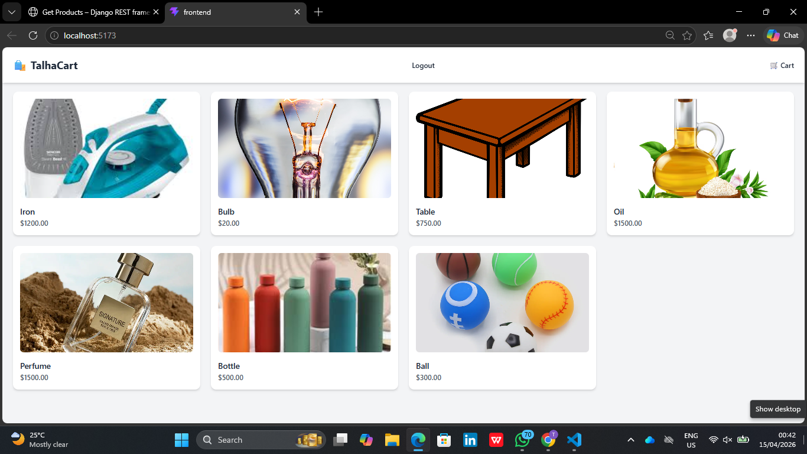
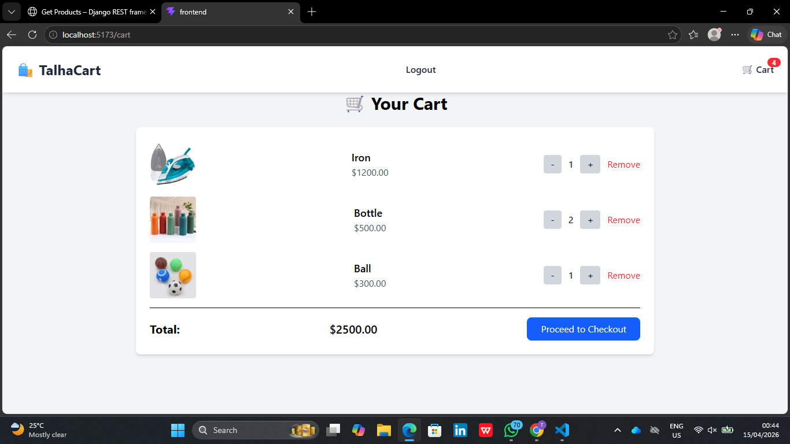
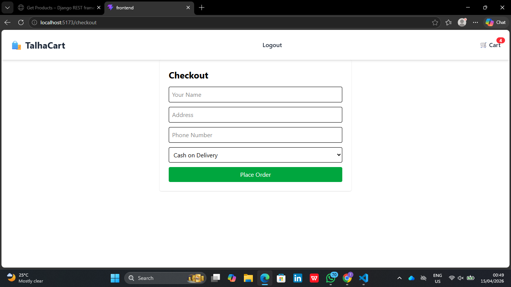

# 🚀 E-Commerce Web Application

A full-stack e-commerce web application built using **React (Frontend)** and **Django REST Framework (Backend)** with **PostgreSQL** database.

## 📸 Screenshots

### 🏠 Home Page


### 🛒 Cart Page


### 💳 Checkout Page


---


## ✨ Features

- 🛍️ Product listing with categories  
- 🛒 Add to cart & update quantity  
- 🔐 User authentication (JWT)  
- 📦 Order placement system  
- 💰 Dynamic cart total calculation  
- 🖼️ Product image handling  

---

## 🧠 Tech Stack

### 🎨 Frontend
- React.js  
- Context API  
- React Router  

### ⚙️ Backend
- Django  
- Django REST Framework  

### 🗄️ Database
- PostgreSQL  

---

---


## 🖼️ Product Images (From Backend Media)

Images are served from Django media folder:

## 📂 Project Structure


Ecommerce-Project/
│
├── backend/
│ ├── backend/ # Django project
│ ├── base/ # App (models, views, serializers)
│ ├── media/
│ │ └── products/ # Product images
│
├── frontend/ # React app
│
├── README.md


---

## 🔄 Application Flow


User → Browse Products → Add to Cart → Checkout → Order Created → Stored in PostgreSQL


---

## 🖼️ Product Images

Images are stored in:


backend/media/products/


Example:


backend/media/products/ball.jpg
backend/media/products/bottle.jpg
backend/media/products/bulb.jpg


---

## ⚙️ Setup Instructions

### 🔧 Backend Setup

```bash
cd backend
pip install -r requirements.txt
python manage.py migrate
python manage.py runserver
💻 Frontend Setup
cd frontend
npm install
npm run dev


🔐 Authentication
JWT-based authentication
Secure API endpoints

👨‍💻 Author
Talha Ahmed
